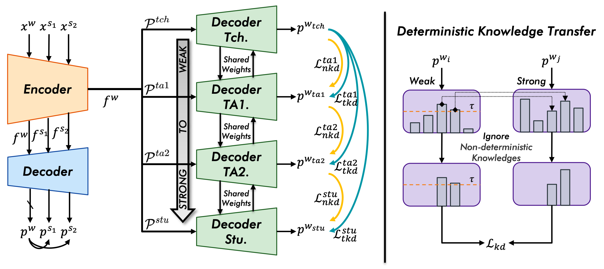

# DistillMatch
Code for this paper: DistillMatch: Revisiting Self-Knowledge Distillation in Semi-Supervised Medical Image Segmentation

🎉🎉🎉 This paper has been accepted by 2024 IEEE International Conference on Bioinformatics and Biomedicine (BIBM) !

> DistillMatch Paper: [](https://ieeexplore.ieee.org/document/10821816)


	
## Requirements

1. Create conda environment:
   ```bash
   conda create -n DistillMatch python=3.11
   ```
2. Clone the repo:
   ```bash
   git clone https://github.com/AiEson/DistillMatch.git
   ```
3. Activate the environment:
   ```bash
   conda activate DistillMatch
   ```
4. Install the requirements:
   ```bash
   cd DistillMatch
   pip install -r requirements.txt
   ```

## Usage
### LA dataset
One click to run:
```bash
cd code
bash train.sh
```

## Citation
If you find this project useful, please consider citing:
```bibtex
@INPROCEEDINGS{10821816,
  author={Wang, Chunshi and Zhao, Bin and Liu, Zhiyang},
  booktitle={2024 IEEE International Conference on Bioinformatics and Biomedicine (BIBM)}, 
  title={DistillMatch: Revisiting Self-Knowledge Distillation in Semi-Supervised Medical Image Segmentation}, 
  year={2024},
  volume={},
  number={},
  pages={3778-3783},
  keywords={Image segmentation;Perturbation methods;Image edge detection;Computational modeling;Benchmark testing;Data models;Computational efficiency;Knowledge transfer;Faces;Biomedical imaging;Semi-supervised segmentation;Self-knowledge distillation},
  doi={10.1109/BIBM62325.2024.10821816}
}
```

## Acknowledgement
* This code is adapted from [UA-MT](https://github.com/yulequan/UA-MT), [DTC](https://github.com/HiLab-git/DTC.git) and [UniMatch](https://github.com/LiheYoung/UniMatch/tree/main/more-scenarios/medical) . 
* We thank Lequan Yu, Xiangde Luo and Lihe Yang for their elegant and efficient code base.

